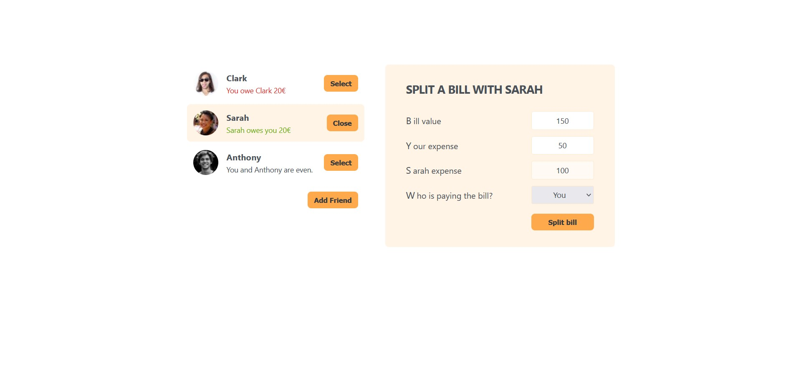

# Eat-and-Split

A simple React application to split bills and share expenses among participants.  
The UI is based on a Udemy React course.

## Overview

Eat-and-Split allows a group of people to record a shared expense (e.g., a meal), input who paid and who participated, and automatically calculate how much each person owes.  
The user interface and component structure follow patterns learned from a Udemy React course.

## Features

- Add a new expense with amount, payer, and participants.
- Automatic calculation of how much each participant owes.
- Clean and simple UI inspired by a Udemy React course.

## Technologies Used

- **React** (Create React App)
- **JavaScript (ES6+)**
- **HTML & CSS**
- **npm** for dependency management

## Installation & Setup

### 1 Clone the repository

```bash
git clone https://github.com/kostelnikp/Eat-and-split.git
cd Eat-and-split
```

### 2 Install dependencies

```bash
npm install
```

### 3 Start the development server

```bash
npm start
```

## Screenshots

### Main page


